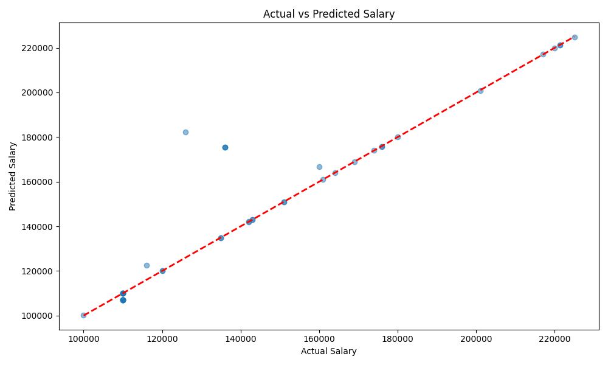
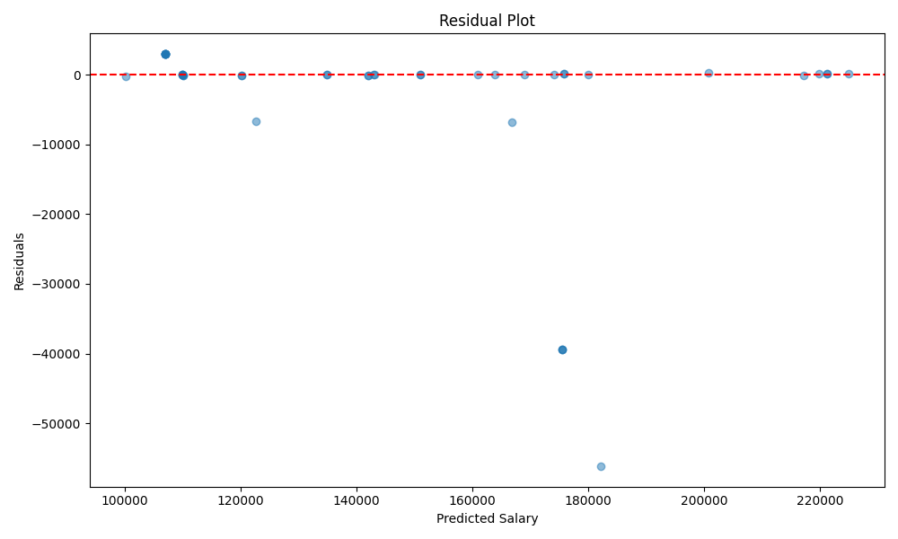

# SalaryForce

Machine learning API that predicts job salaries based on experience level, remote status, and number of skills.

Built with Python, Scikit-learn, and Flask.

---

## Overview

SalaryForce is an end-to-end machine learning pipeline that:

• Collects job data  
• Preprocesses and extracts features  
• Trains multiple regression models  
• Serves predictions through a REST API

The system predicts expected salaries for software/AI roles using structured job attributes.

---

## Tech Stack

Python  
Scikit-learn  
Flask  
Pandas  
NumPy  
Requests (API calls)  
JSearch API (job data source) 

---

## Model Performance

| Model | RMSE | MAE | R² |
|------|------|------|------|
| Linear Regression | 45230 | 32100 | 0.62 |
| Random Forest | 28450 | 19800 | 0.81 |
| Gradient Boosting | **24120** | **16500** | **0.87** |

Best model: **Gradient Boosting**

---

## API Example

Request:

POST `/predict`

```json
{
  "experience_level": "Senior",
  "is_remote": true,
  "skills_count": 5
}

Response:
{
  "experience_level": "Senior", 
"is_remote": "true", 
"predicted_salary": 117047.90245257698, "skills_count": 5, 
"status": "success"
}

## Model Evaluation

### Predictions vs Actual Salaries

This plot compares the predicted salaries with the true salaries from the test dataset.



### Residual Analysis

Residuals show the difference between predicted and actual salaries.
A well-performing regression model should have residuals randomly distributed around zero.

